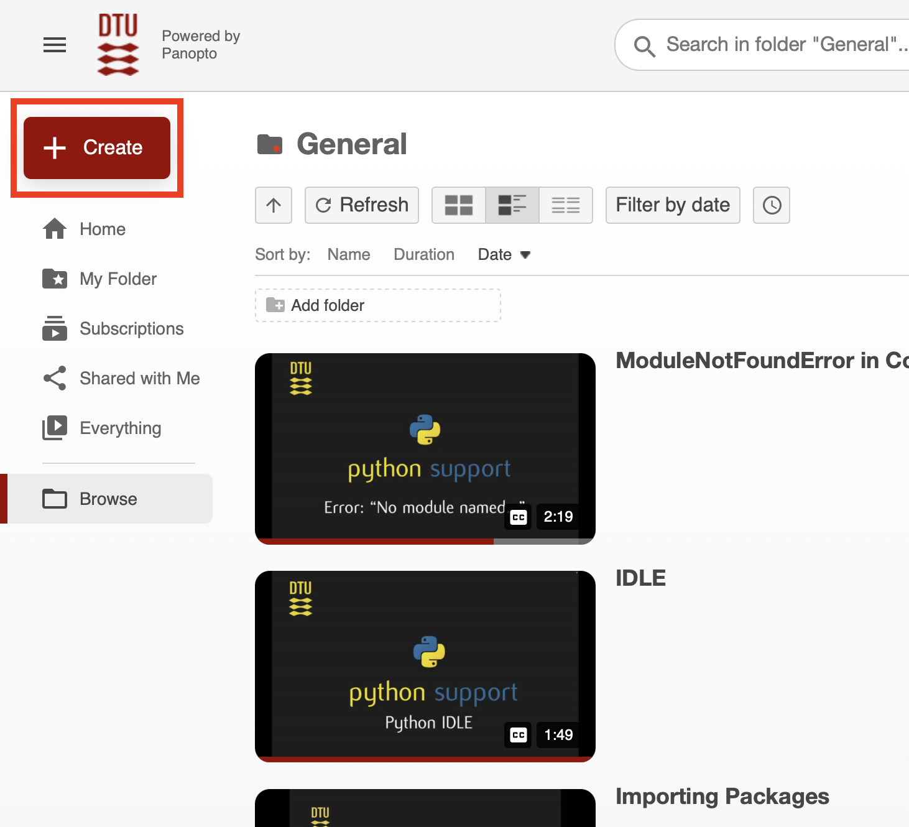
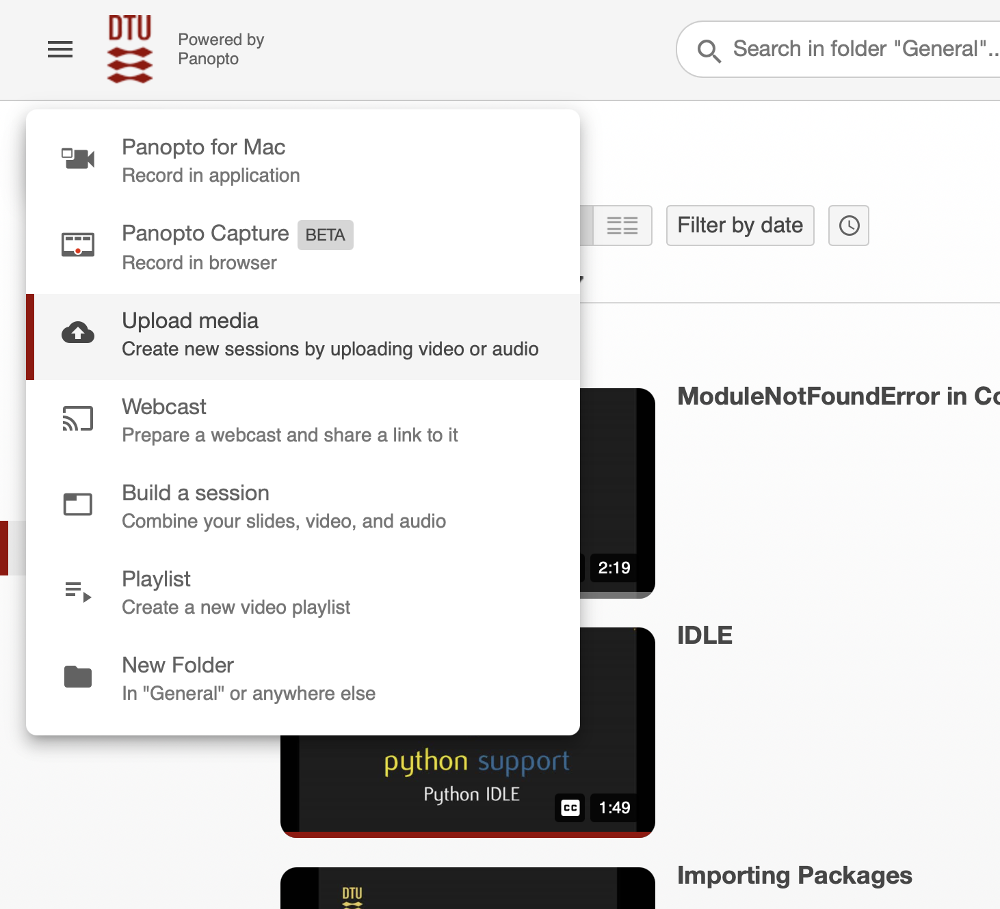
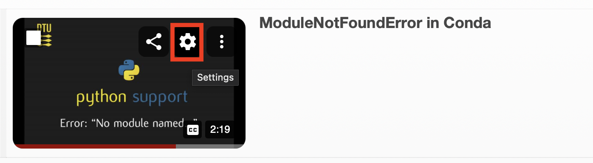
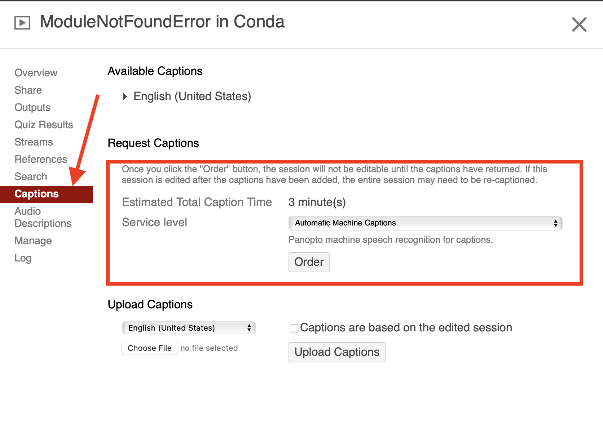
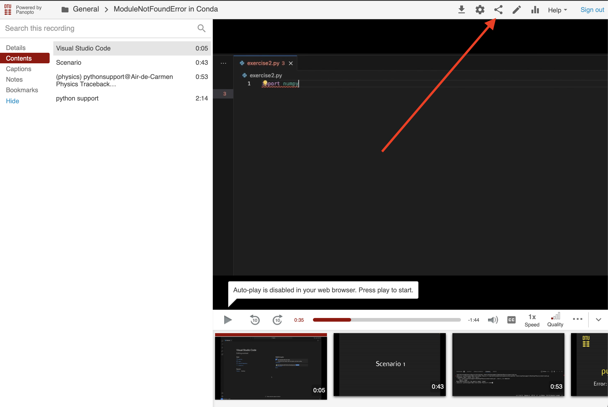
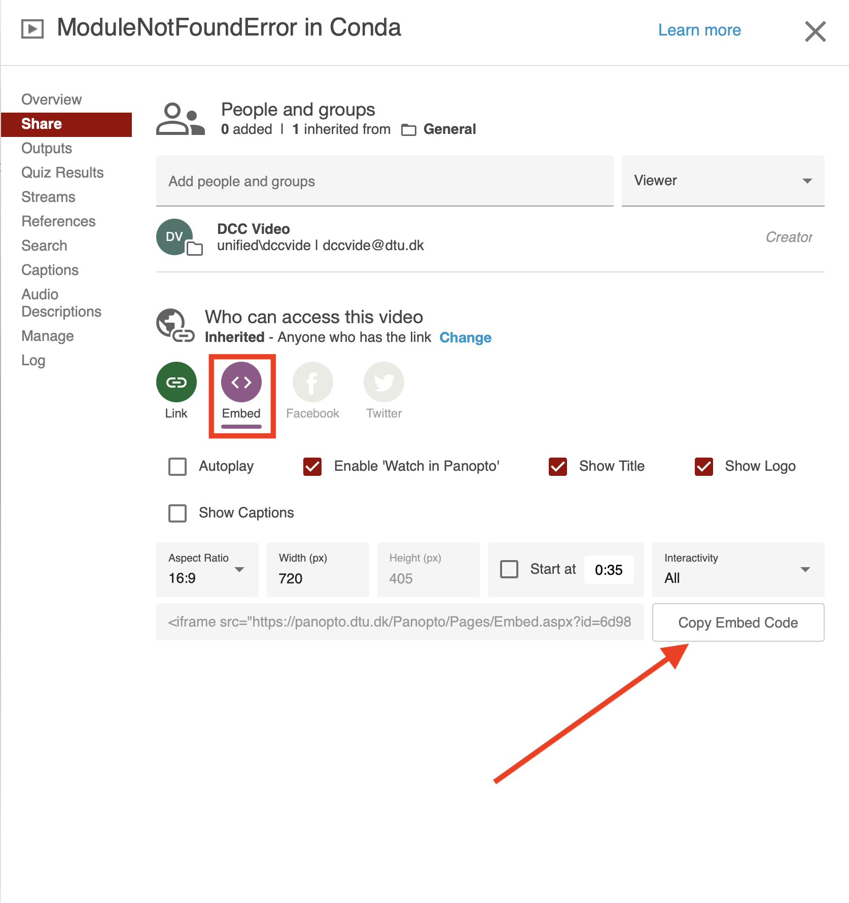

Panopto documentation
=====================

This guide shows how to create videos tutorials and publish them on Panopto.

How to record your screen
-------------------------

.. tab-set::
    :sync-group: os

    .. tab-item:: {{ windows }}
        :sync: windows

        .. image:: ./images/panopto/windows_record.png
            :width: 600
            :align: center

        The snipping tool in Windows 11 includes screen recording capabilities.
        A thorough guide can be found on Microsoft's website: `here <https://www.microsoft.com/en-us/windows/learning-center/how-to-record-screen-windows-11>`_.
        
    .. tab-item:: {{ macos }}
        :sync: mac

        .. image:: ./images/panopto/macos_record.jpg
            :width: 600
            :align: center
    
        In order to record your screen on your mac press :kbd:`Cmd+Shift+5`, select an area and press record. 
        When finished turn of the recording by pressing the stop icon the the menu bar. 
        The recording will by default be saved to the desktop.
        A thorough guide can be found on Apple's website: `here <https://support.apple.com/en-us/102618>`_.

How to edit videos
------------------

In order to edit the screen recordings we use the DaVinci resolve editor.
Install DaVinci resolve by clicking `here <https://www.blackmagicdesign.com/products/davinciresolve>`_.

When installed follow this guide on how to create videos:

.. raw:: html

    <iframe src="https://panopto.dtu.dk/Panopto/Pages/Embed.aspx?id=1f55ba1e-4d07-44c7-9e78-b2b600bc02c3" height="405" width="640" style="border: 1px solid #464646;" allowfullscreen allow="autoplay"></iframe>

The title screen / thumb nail template can be found here.

How to upload and add subtitles
-------------------------------

1. Login
~~~~~~~~~

We use the Panopto user *dccvide* to upload videos.
Go to `panopto.dtu.dk <https://panopto.dtu.dk>`_ and login with *dccvide*.

2. Upload
~~~~~~~~~

Videos must be uploaded to "My folder/Python Support/" in an appropriate subfolder.
A video is uploaded by clicking on the "Create" button as shown below.

3. Add subtitles
~~~~~~~~~~~~~~~~

In order to make the videos accessible we add subtitles.
To access the subtitles settings open video settings as shown below.

Adding these settings and pressing "Order" will add autogenerated subtitles to the video.

4. Embedding the video on the webpage
~~~~~~~~~~~~~~~~~~~~~~~~~~~~~~~~~~~~~~

In order to embed the video on the webpage press the share button.

Click the embed button and set appropriate settings for the embedded video. 
Make sure to enable that the video is available to everyone. Then copy the code to embed the video.

The video can now be included in a rst document by using the copied code from above:

.. code-block:: rst

    .. raw:: html

        <iframe src="INSERT URL HERE" height="y" width="x" style="border: 1px solid #464646;" allowfullscreen allow="autoplay"></iframe>
