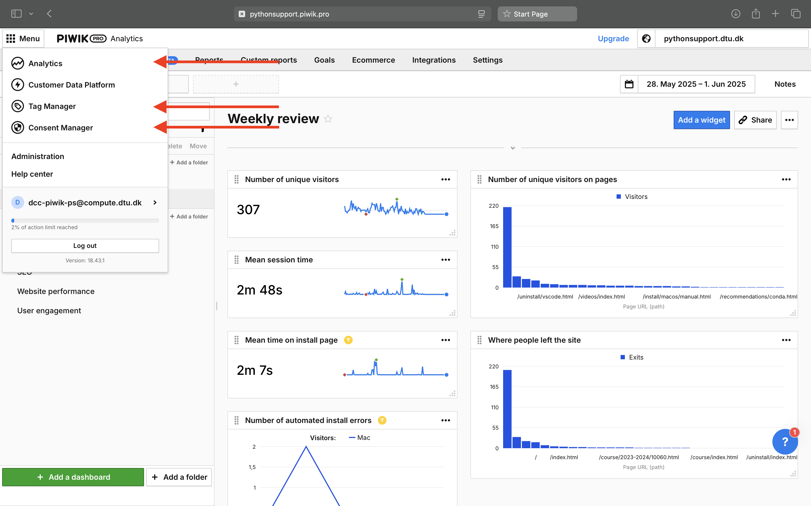
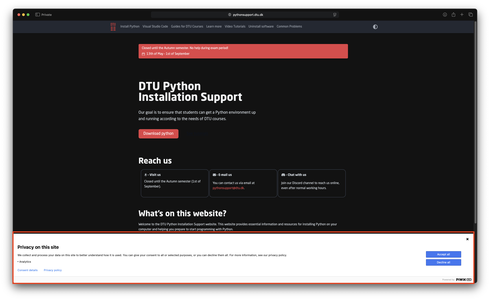
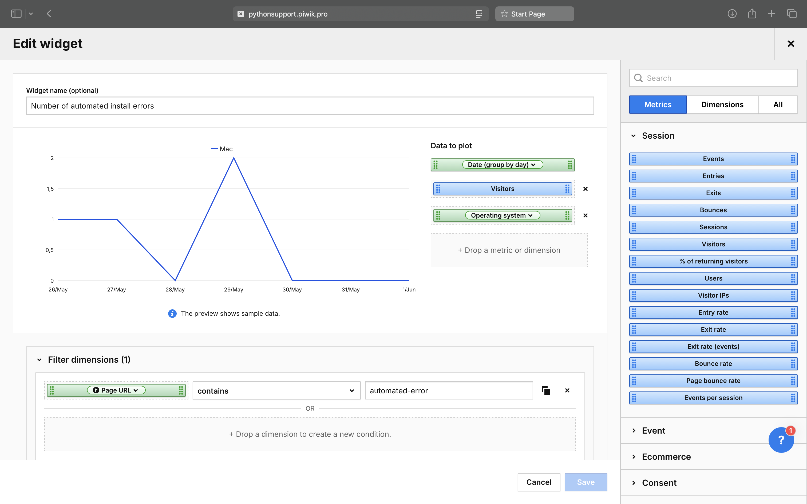
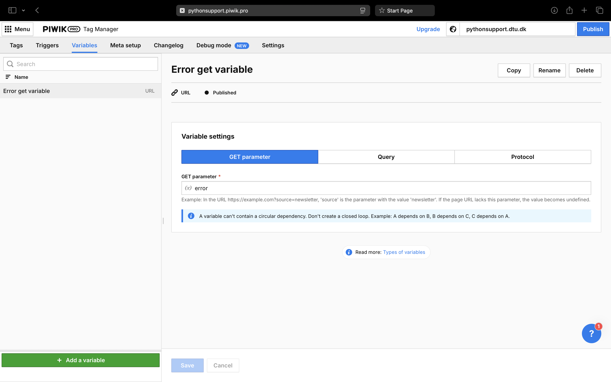
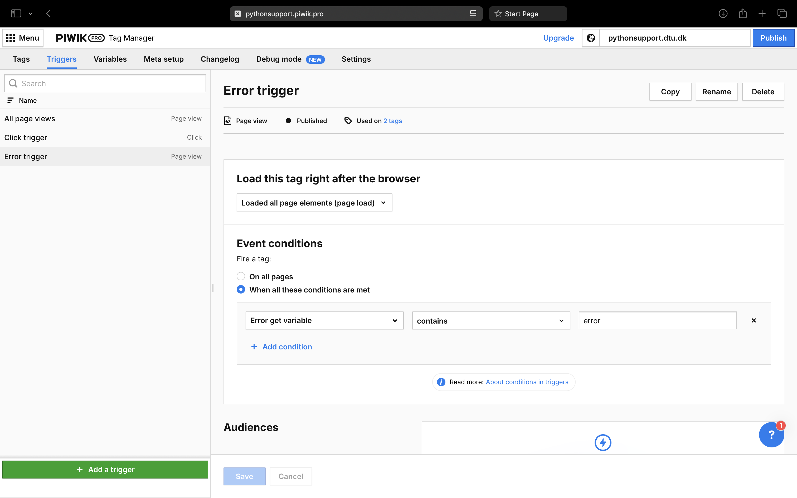
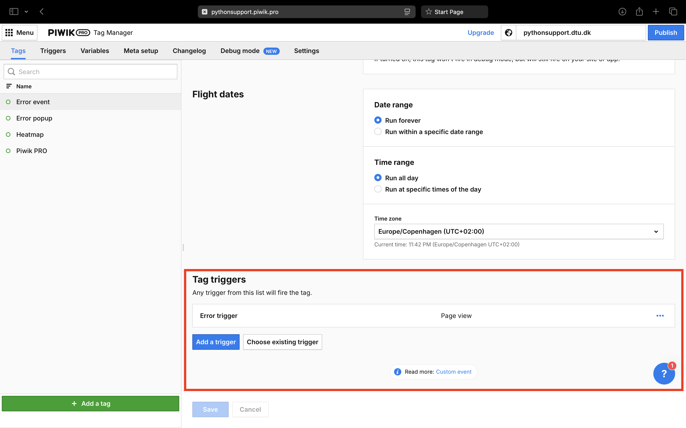
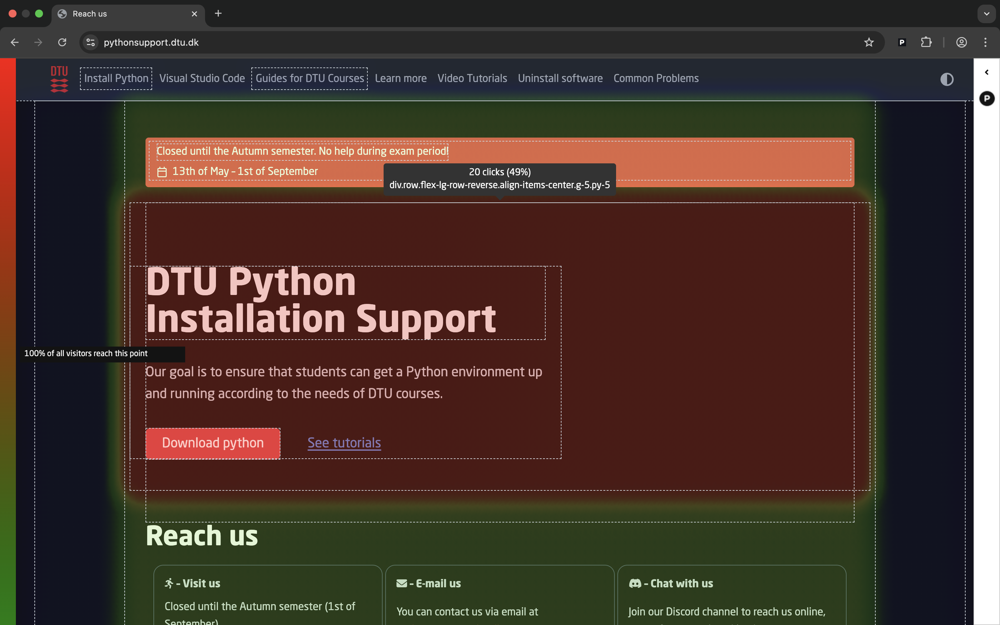

:nosearch:

.. _piwik-documentation:

Piwik documentation
----
This page contains information on how to use Piwik. The subjects covered are:

.. contents::
   :backlinks: none
   :local:

For a tutorial to set up a custom event see: :ref:`this guide <piwik-custom-event-tutorial>`.

Helpful links:

* `Piwik PRO Help Center <https://help.piwik.pro>`_
* `Piwik PRO YouTube Tutorial <https://www.youtube.com/watch?v=O_its-ChPTg&list=PLgjjMVHirGE_7ET0nb7ZUv7wN2P4sTRpE>`_

The parenthesis of the sections below: "()" indicate where to find the topics of the section in piwik. Use the "Menu" button to navigate to the indicated page.

*
    **Analytics**: Where all of the dashboards can be accessed

*
    **Tag manager**: Where to add tags(functions that runs in the users browser), triggers and variables. Any changes only takes effect after the "publish" button has been pressed.

*
    **Consent manager**: Settings for how the "allow-cookies" popup should look like.

Terminology
====

*
    **Tag**: Javascript function that runs on the users computer and is fired by a trigger.

*
    **Bounce rate**: A web analytics metric that represents the percentage of visitors to a website who leave the site after viewing only one page.

*
    **Event**: Events are sent by tags when specific triggers are fired. Events can be analyzed by creating custom widgets on the dashboard. An event could for example be that an error occurs while the visitor is installing Python.  

* 
    **Goal**: An important event that happens on the site. Could for example be that a visitor successfully downloads and installs Python.

User Consent (Consent manager)
=======

In order to GDPR appliant Piwik will insert a pop-up on the website when the user is first visiting.
Here a user will be able to choose which metrics we can collect and use them. Even if the user rejects
all options, Piwik will still be able to track certain parameters. The triggers an tags we use relies on
the user accepts "Analytics", which is the only thing we ask them to accept at the moment.

Other consent types include:

*
    **AB Testing and Personalization**: Can for example be used to open pop-ups from tags.

*
    **User feedback**: Surveys, on-site-polls, etc..

Segments (Analytics)
====
Segments are filters to be applied globally when viewing a dashboard of widgets.

Current segments:

*
    **"Denmark"**: which filters IP-addresses from denmark. This is useful in accessing how well the website performs on DTU students.

Other possible segments could for example be filtering IP-addresses from DTU, or which operating system a visitor is using.

.. image:: ./images/piwik_documentation/piwik_segments.png
         :width: 600
         :align: center

Dashboards (Analytics)
====

Dashboards are a collection of widgets that presents a data collected over a period. This period can be set in the top right corner.

Current dashboards:

*
    **Custom events**: This dashboard shows the analytics of the custom events that have been configured by us. These include: "Download python" clicks, number of failed installations, number of successful installations. 

* 
    **Weekly review**: Shows number of unique visitors, mean session time, mean time on install page, number of automated install errors, page views.

.. image:: ./images/piwik_documentation/piwik_dashboard.png
         :width: 600
         :align: center

.. Note::

    It can take a bit of time for Piwik to show data from user sessions.

Widgets (Analytics)
====

Widgets are self contained graphs/tables/counters that display information about the site.
On creation of a widget you are presented with a list of:

* 
    dimensions (color=green, values that you can filter against), 
* 
    metrics (color=blue, values you can display).

Filters can be applied to dimensions to create insightful widgets.

Examples are:

*
    **Number of install errors**: Display the "Visitors" and "Operating system" and filter against all URL's that contain "automated-error". This is useful since it can tell us if we have a major problem with the automatic install on a specific system.

*
    **Mean time on install page**: Display "average time on page" and filter for "Page URL" contains "https://pythonsupport.dtu.dk/install/". This is useful in that it can indicate how easy the install guides are to follow.

         
         Example of how to use the filtering with a dimension to get useful statistics on the number of install errors.

Variables (Tag manager)
====

Variables can be used for setting conditions for when triggers are supposed to fire. Variables can get information from the URL, Cookies, DOM elements, and more.

Current variables:

*
    **There are no current variables**

         
         Example of a custom variable that looks for the URL get parameter ?error=...

Triggers (Tag manager)
====

When specific conditions are met a trigger can be fired. The code that a trigger executes is called a Tag. 
For example a trigger can executed when:

* 
    A user scrolls past a specific percentage down the screen.
* 
    A user clicks on a specific element/button.
* 
    A user visits a specific URL with query elements.

Current triggers:

*
    **All page views**: This trigger is fired for all page views. It calls the **Piwik PRO** tag to get basic site statistics.

*
    **Click trigger**: This trigger is fired for all clicks that happens on the site. It calls the **Heatmap** tag to get statistics on what the user is clicking on.

*
    **Download Python button click**: This trigger fires when a user clicks on the "Download python" button on the main page.

*
    **Automatic installation error page visit**: This trigger fires when a user visits a URL that contains "automated-success".

*
    **Automatic installation success page visit**: This trigger fires when a user visits a URL that contains "automated-error".

         Example of how a custom trigger can look. This trigger used a custom variable and fires when that variable contains "error".

Tags (Tag manager)
====

Tags are small self contained javascript functions that runs on the users browser as a part of a trigger. Tags can have different priorities which can be set in (Tag Manager / Settings).

What you can do with tags include:

*
    Send custom analytics events when the user interacts with the site.

*
    Make custom interactions with users, like having a popup when a specific trigger has been fired.

.. Note::
    Every tag has a "Consent type" for which the user has to agree to before the tag can be fired.

    For us to send a custom event we need the "analytics" consent. For a tag to open a popup-modal we need the "AB Testing and Personalization" consent.

In order for a tag to be executed a trigger must be set in the tag manager:

         Where to find and add triggers to piwik tags.

A very useful way to confirm that a tag is working in the intended way is to use the "Debug mode" feature.

Current tags:

*
    **Download python tag**: This tag is fired by the "Download Python button click" trigger. It creates a custom event called "Download python event" which is visualize in the "Custom events" dashboard and under (Analytics / Goals).

*
    **Heatmap**: Every time a user clicks on a page the item being clicked on is recorded and send to the server. The resulting heatmap and scrollmap can be seen using the `Piwik chrome extension <https://chromewebstore.google.com/detail/njcnagohlmamfijimejlnelenhahnoce?utm_source=item-share-cb>`_. This is very insightful when analyzing how visitors use the page. 

* 
    **Piwik PRO**: The basic tracking analytics for the site.

*
    **Automatic installation error tag**: This tag is triggered by "Automatic installation error page visit", and sends a custom event: "Automatic installation error event". Analytics of this event can be seen in the "Custom events" dashboard and under (Analytics / Goals).

*
    **Automatic installation success tag**: This tag is triggered by "Automatic installation success page visit", and sends a custom event: "Automatic installation success event". Analytics of this event can be seen in the "Custom events" dashboard and under (Analytics / Goals).

         Heatmap for the home page of the site.

Goals and Reports (Analytics)
====

In Piwik goals are the must important interactions that happen on the site. For a shopping website an example of a goal could for example be:

* How many visitors buy something from the shop.
* How many visitors sign up for the newsletter.
* How many visitors that creates an account on the site.

A goal can be fired by one or more custom events, or be tracked manually.

Current goals:

* **Download python button click**: How many people clicks the "Download python" button on the main page.

.. figure:: ./images/piwik_documentation/piwik_goals.png
         :width: 600
         :align: center

         An example of a goal in piwik.

.. Note::
    The term conversion rate is the percentage of visitors for where a goal event has happened.

.. Note::
    A goal can capture more information about how it was triggered. Only after creating a goal with a specific trigger event will this data get tracked.

Using goals automatically creates analyses to viewed  under the "Reports" tab. Much of the same information in the reports can be included by widgets in custom dashboards. The must useful reports are:

* **Audience overview**: How many visitors the site has had 
* **Devices & software**: What devices were used to access the site.
* **Engagement**: The amount of returning visitors
* **Channels**: From which other website are visitors being directed from.
* **Pages**: What pages are people visiting

Useful report for debugging:

* **Session log**: All of the events that has happened for every visitor to the site.

.. figure:: ./images/piwik_documentation/piwik_reports.png
         :width: 600
         :align: center

         An example of a report in piwik.

