:orphan:

.. _piwik-custom-event-tutorial:

Piwik custom event tutorial
---------------------------

In this tutorial we will be creating a custom event for capturing a specific user interaction on the site. We will be doing this in two ways:

#. Using **widgets**
#. Using **goals**

Introduction
~~~~~~~~~~~~

Lets say we want to find out how many visitors clicks on the "Download python" button in the main hero. This button has the classes "btn btn-primary btn-lg px-4 me-md-2" attached to it. We will be using the class selector in order to determine if the button has been pressed.

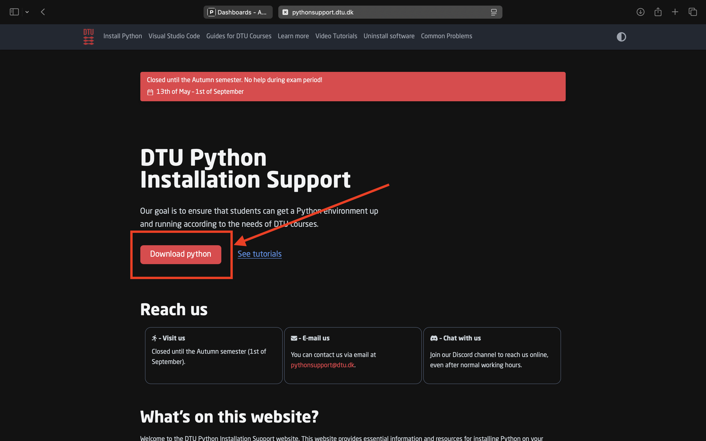

1. Define custom trigger
~~~~~~~~~~~~~~~~~~~~~~~~

The first thing to do is to create a custom trigger that captures the user clicking on the button. This is done in (Tag Manager / Triggers ) and clicking "Add a trigger".

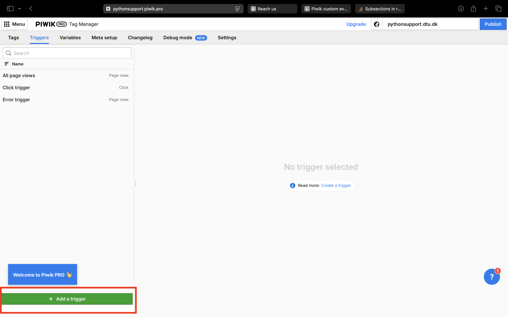

Choose the "Click" trigger template.

.. image:: ./images/piwik_tutorial/piwik_add_click_trigger.png
         :width: 600
         :align: center

Since we are capturing clicks on the "Download python" button we set conditions to be "Click classes" equals "btn btn-primary btn-lg px-4 me-md-2" (known by looking in the source code). If there were more elements with this combination of classes these buttons would also fire this trigger. Give the trigger an appropriate name as we will use this name when applying the trigger to a tag. In this case I have called the trigger "Download Python button click".

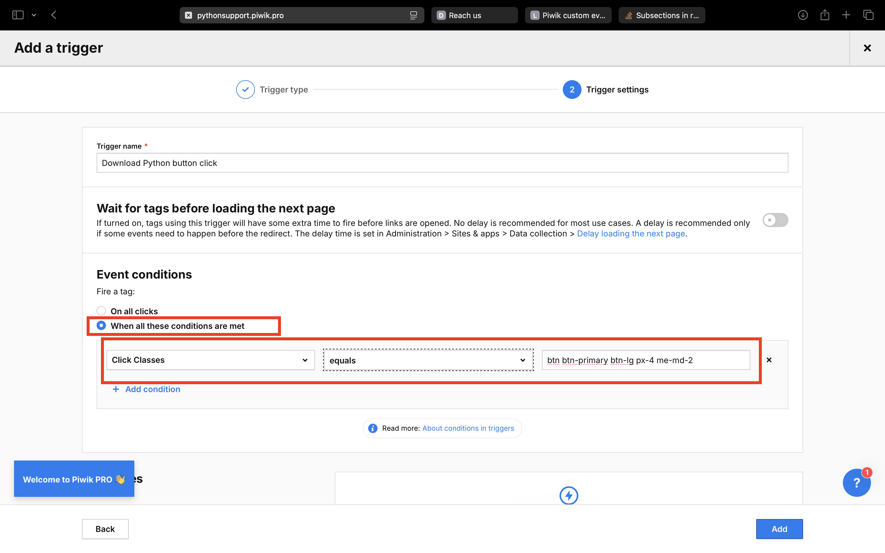

2. Create custom event tag
~~~~~~~~~~~~~~~~~~~~~~~~~~

Go to (Tag manager / Tags) and press "Add tag".

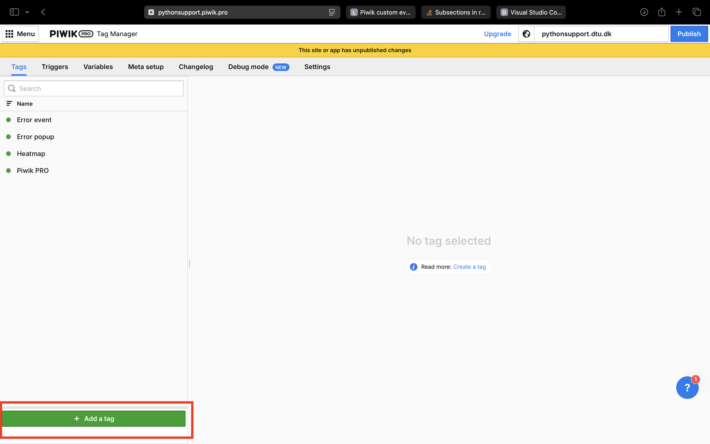

Then press "Add custom event".

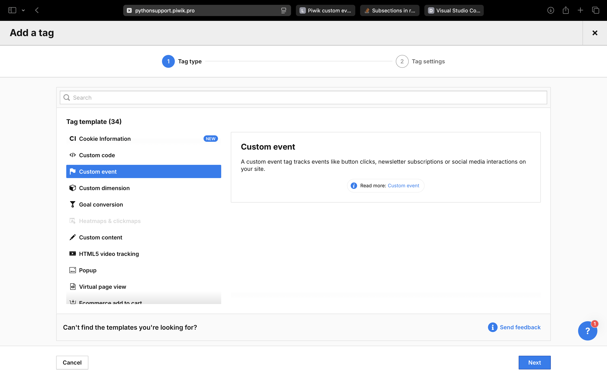

Here we add details about the event we want to send back to the server. We will set the event category as "Click", the action as "Download button pressed" and the name as "Download python event". In the Consent type options we can set the appropriate privacy level of our trigger. We will leave it as the default ("Analytics"), meaning that this will only be called if the user has agreed to participate in analytics.

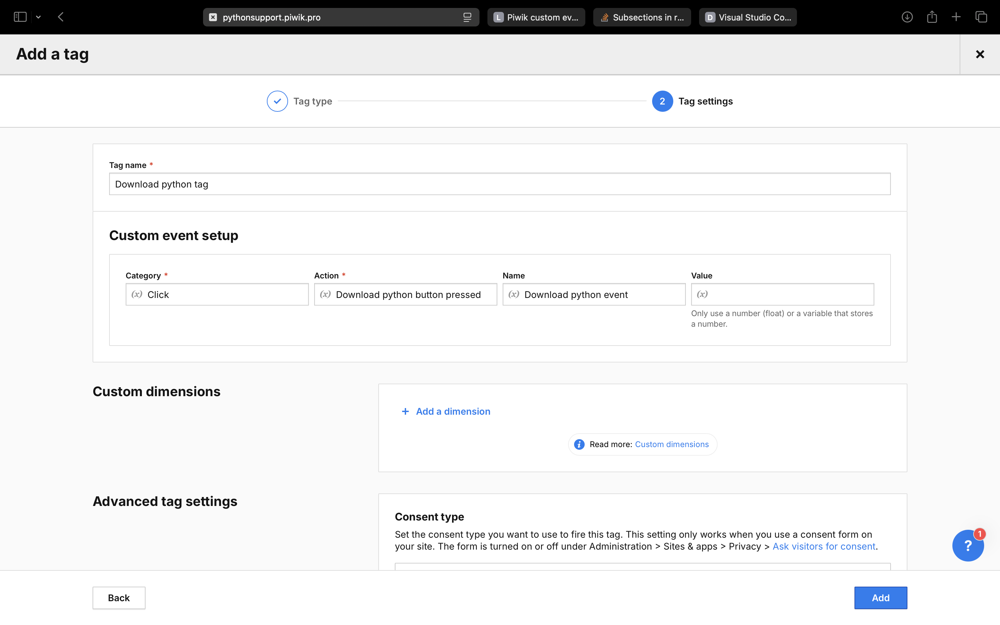

Scrolling down we find a button to add a trigger to the tag. Press "Choose existing trigger", and then find the trigger we create before.

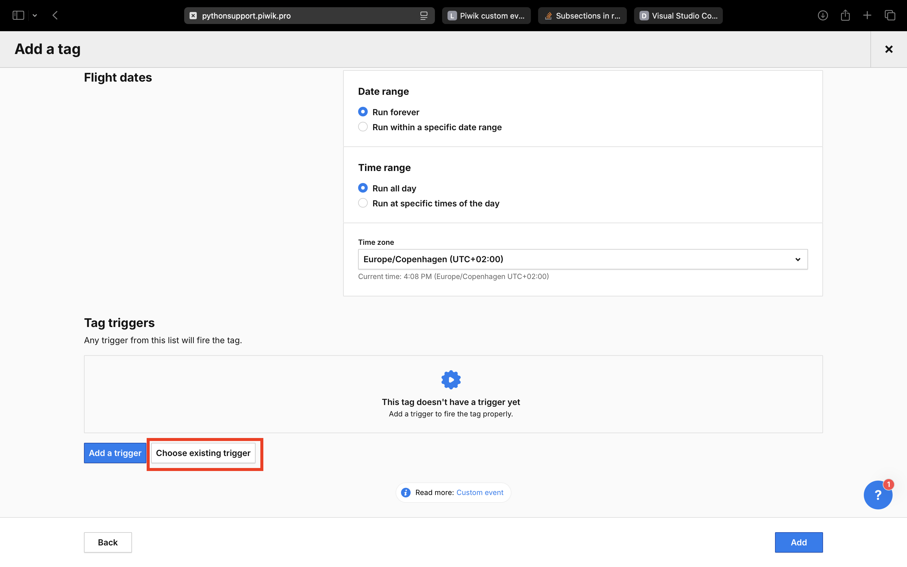

.. image:: ./images/piwik_tutorial/piwik_add_event_tag_trigger_choose.png
         :width: 600
         :align: center

We are now ready to test the tag and the trigger. Go to (Tag Manager / Debug mode) and connect to the home page.

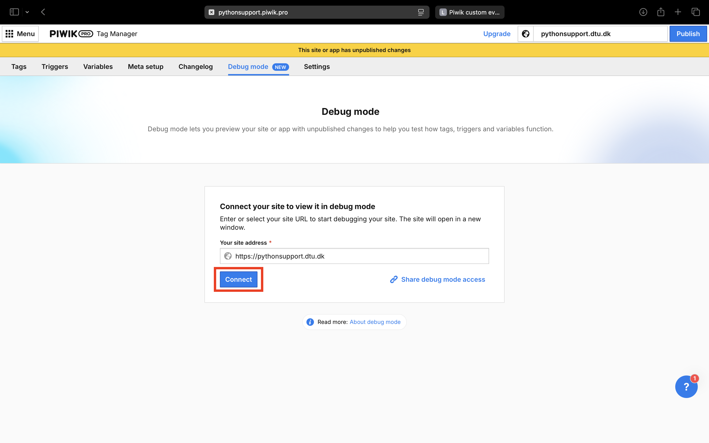

When the page opens press the "Download python" button.

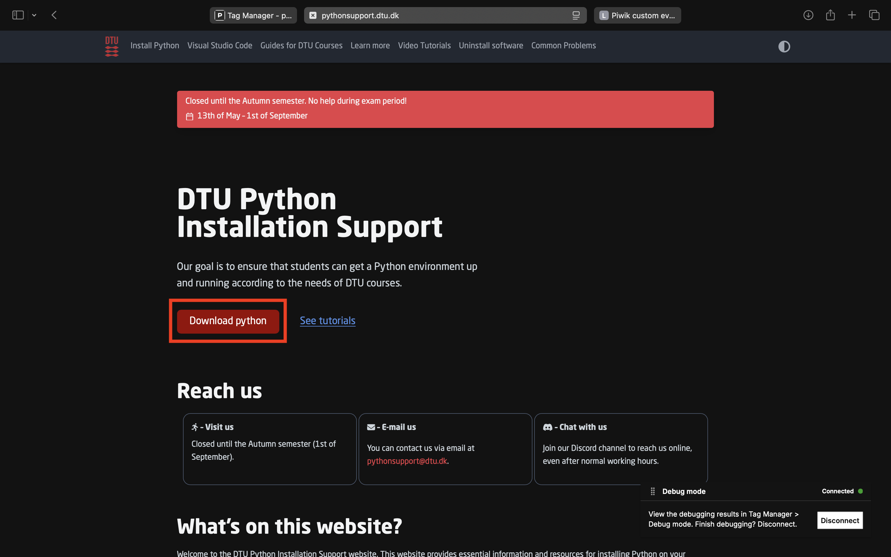

On the debug panel we now see that the tag has been fired.

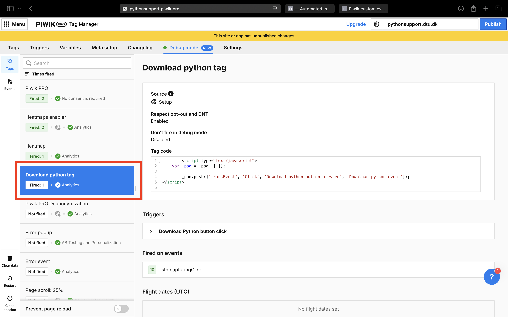

This tag will not at the moment work for other visitors since it hasn't been publish yet. To see which tags that are not published go back to (Tag manager / Tags). The tags with a filled circle has been published while the tags with only outlines have not. Press the publish button to enable the tag for all visitors.

.. image:: ./images/piwik_tutorial/piwik_publish.png
         :width: 600
         :align: center

Great successes! We are now tracking the when users click on the "Download python" button.

3. Analyze custom events in a widget
~~~~~~~~~~~~~~~~~~~~~~~~~~~~~~~~~~~~

In order to see the number of user clicks on the "Download python" button we will create a custom widget on a dashboard. Go to (Analytics / Dashboards) select a dashboard and click "Add widget" and then click "line chart".

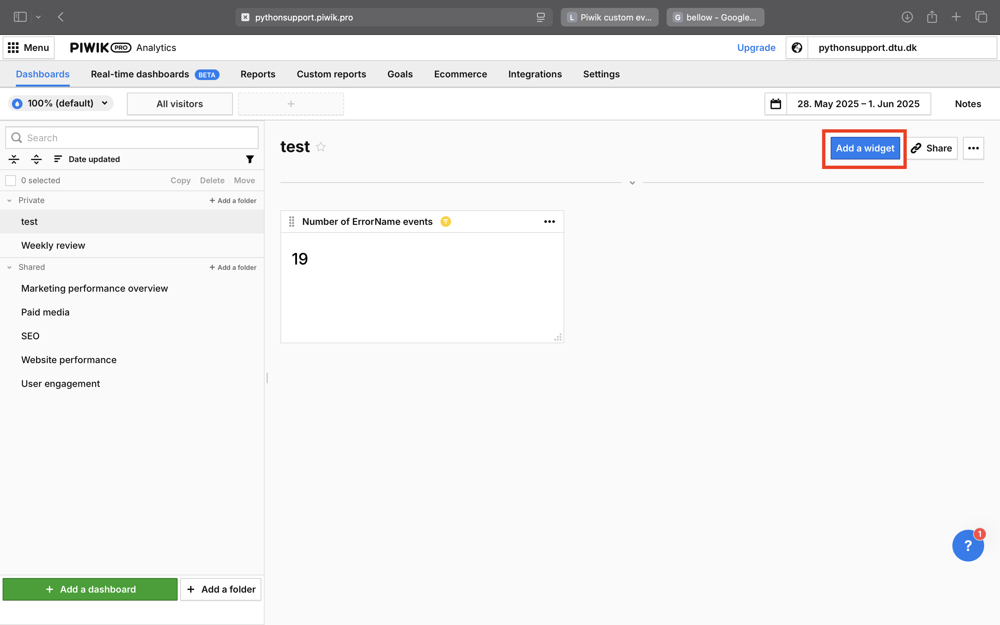

In order to only see the download python events we will filter by the event name.

.. image:: ./images/piwik_tutorial/piwik_add_widget_setup.png
         :width: 600
         :align: center

4. Analyze custom event in goals
~~~~~~~~~~~~~~~~~~~~~~~~~~~~~~~~~

Another way to analyze how many people clicked on the download button is to use a goal.
A goal is intended for events on the site that are of special interest. An example could 
be a person sining up for a newsletter or completes a purchase. A goal gives better analytics
per default.

To setup a goal go to ( Analytics / Goals ) and click the "Add a goal" button.

.. image:: ./images/piwik_tutorial/piwik_add_goal.png
         :width: 600
         :align: center

Next we have to specify when a goal is reached. In this example we already 
have the "Download python event" so we only have to connect this event as the
condition.

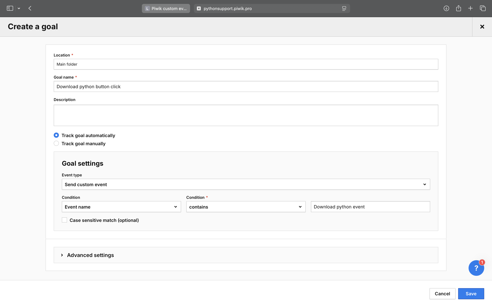

We can now see the goal and analyze how it is being fulfilled.

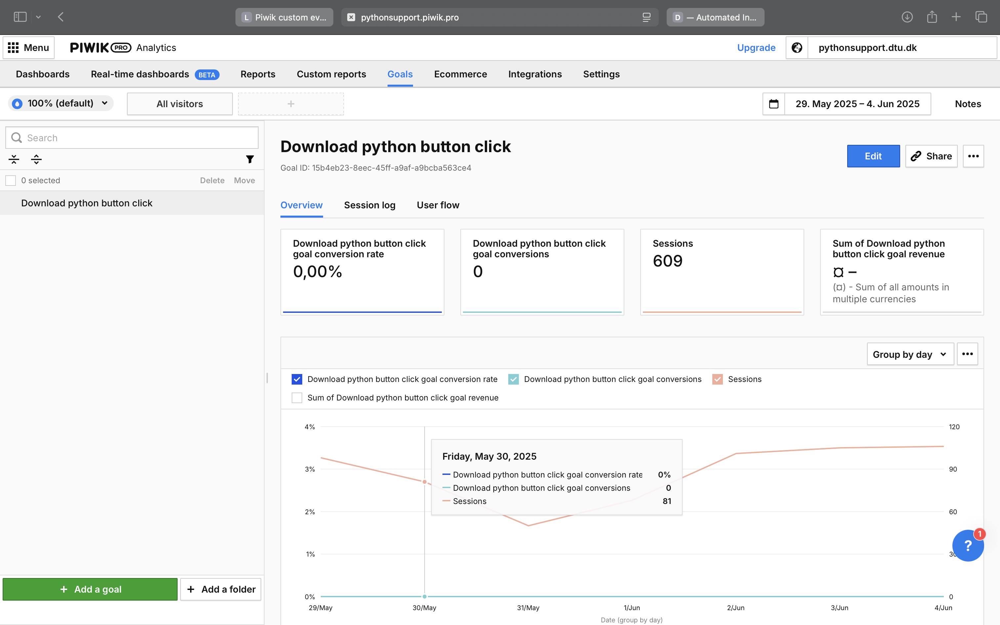

.. tip::

    It can take some time to get enough data for piwik to be able to
    visualize the data. Be patient.
