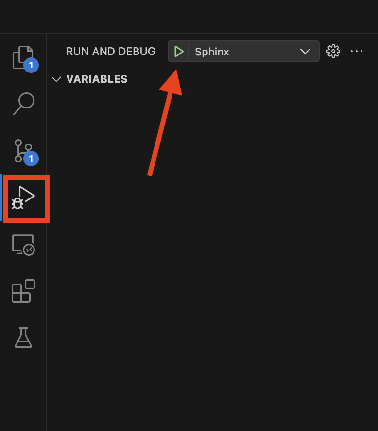
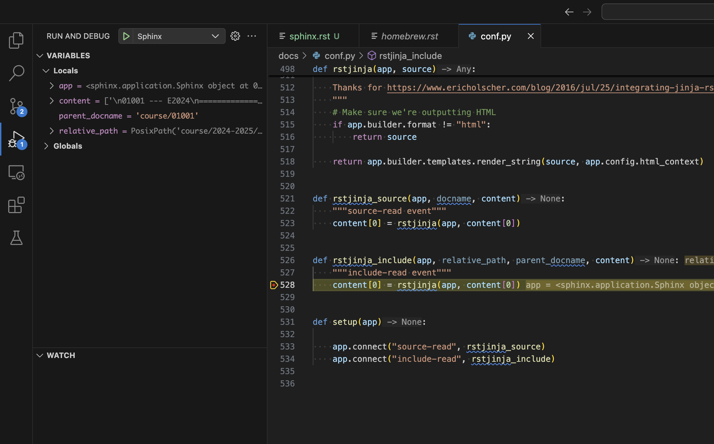

:nosearch:

.. _internal-sphinx:

Sphinx Development Documentation
================================

This document outlines some of the internals of Sphinx and how to extend it.
A good resource to get started with the internals of Sphinx include:

* `Customizing Sphinx: Simple, Normal, and Hard (Video) <https://www.youtube.com/watch?v=9dsy9H3yrP0>`_
* `Sphinx Extension documentation (Text) <https://www.sphinx-doc.org/en/master/usage/extensions/index.html>`_

Sphinx uses .rst (reStructuredText) files in order to create documents. 
The .rst format was intentionally made highly extensible with users being
able to define their own directives and roles. 

An example of a custom directive is:

.. code-block:: rst

    .. custom-directive:: option
        :option-a: true
        :option-b: false

        input

An example of a custom role is:

.. code-block:: rst

    Here is some text :custom-role:`input`.

In the following sections we investigate how to implement a Sphinx extension
that implements both a directive and a role.

Custom directives
-----------------

Examples of directives can be found in the Sphinx documentation `here <https://www.sphinx-doc.org/en/master/usage/restructuredtext/directives.html>`__.
These directives are all from the Sphinx source code.

A hello world directive looks like:

.. code-block:: python

    from docutils import nodes
    from docutils.parsers.rst import Directive

    class HelloWorldDirective(Directive):
        def run(self):
            paragraph_node = nodes.paragraph(text="Hello, world!")
            return [paragraph_node]

In conf.py add :code:`app.add_directive("hello", HelloWorldDirective)` to the setup(app) function so it ends up looking like this:

.. code-block:: python

    def setup(app):
        app.add_directive("hello", HelloWorldDirective)
        app.connect("source-read", rstjinja_source)
        app.connect("include-read", rstjinja_include)

This adds the .. hello directive to be used in all sphinx files. The code:

.. code-block:: rst

    .. hello

becomes "Hello, world!" when rendered.

**Current custom directives:**

* No custom directives

Custom roles
------------

Roles can be seen as an inline directive in paragraphs. Examples of roles can be found `here <https://www.sphinx-doc.org/en/master/usage/restructuredtext/roles.html>`__.

A hello world role looks like:

.. code-block:: python

    from docutils import nodes

    def hello_role(name, rawtext, text, lineno, inliner, options={}, content=[]):
        node = nodes.strong(text="Hello, world!")
        return [node], []

In conf.py add :code:`app.add_role('hello', hello_role)` to the setup(app) function so it ends up looking like this:

.. code-block:: python

    def setup(app):
        app.add_role('hello', hello_role)
        app.connect("source-read", rstjinja_source)
        app.connect("include-read", rstjinja_include)

**Current custom roles:**

* ``mailto`` allows a custom specification of a mail with a template.

Custom extensions
-----------------

Sphinx extensions can do a lot more than just providing custom codes for .rst documents. 
In this project we use two extensions to do the following:

* Custom template generation for environments (generate_env_pages_from_json)
* Custom titles for documents (add_title_to_context)

**add_title_to_context**:

This extension modifies the title of the document using the :title: page metadata.
If :title: is not provided then the title of the page would be the text of the first
section title.

.. code-block:: rst

    :title: This is my custom page title

    My old title
    ============

    Content
    -------

This is done by hooking into the Sphinx "html-page-context" event for every 
page and modify it according to the provided metadata.

**generate_env_pages_from_json**

This extension creates install guides for provided environments.yml files with
specific metadata included. This extension hooks into the "builder-inited" event
and generates .rst files from the template "_templates/environment_installation.rst".
The generated guides are placed in "docs/environments/course/{course_identifier}".

This extension requires the html_context["environments"] field in conf.py is populated 
with the information about the environment.yml files located in "docs/_static/environments/".

These .yml files have the same structure as the environment files produced by :code:`conda export --no-builds`
with the exception of removing the "prefix" field and adding the metadata as shown below.

.. code-block:: yaml

    metadata:
        course_full_name: "Course name"
        course_number: "xxxxx"
        course_year: "2026"
        course_semester: "Spring"

    name: "0xxxx_S26" or "0xxxx_E26"
    channels:
        - conda-forge
    dependencies:
        - ipykernel
        - numpy=2.2.0
        - python=3.13.4
        - pip
        - pip:
            - matplotlib

How to debug
------------

In order to debug these custom extensions to Sphinx a VS-code "launch.json" file has been
provided. This will start a sphinx_autobuild session with the debugpy debugger attached.
It is not necessary to restart the debugger when a change to the source code is 
made since the site is hot reloaded on save.

Launch by pressing :kbd:`F5` or go into the debug menu and clicking on start debugging:

Breakpoints can now be set in the conf.py file.

